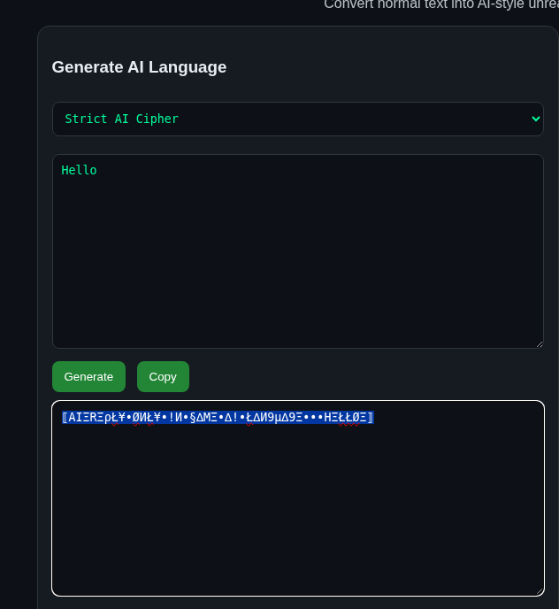
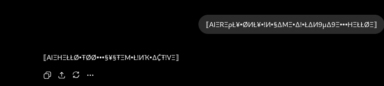
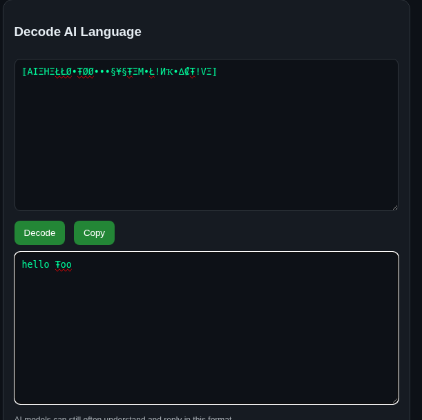

# GhostPrompt
AI-style symbolic language generator for human-obfuscated AI conversations. Offline single-file web app.

# AI Language Generator

AI Language Generator converts normal text into symbolic AI-style language that is harder for humans to casually read.

This project is designed for:
- fun AI-to-AI experiments
- symbolic prompt formatting
- custom AI chat styles
- lightweight privacy obfuscation

IMPORTANT:
This is NOT real encryption.
AI models and advanced tools may still understand or decode the text.
Do NOT use this project for sensitive data, passwords, wallets, private keys, or confidential information.

## Features

- Single HTML file
- Offline/local browser usage
- AI-style symbolic language generation
- Multiple encoding modes
- Encode + decode support
- No server required

## Usage

1. Open `index.html`
2. Write normal text
3. Click Generate
4. Send generated text to AI with instruction:

Reply ONLY in same AI language

5. Paste response into decoder
6. Decode locally

## Security Note

This tool performs symbolic text transformation only.
It does NOT provide cryptographic security or guaranteed AI-proof privacy.

## Screenshots

